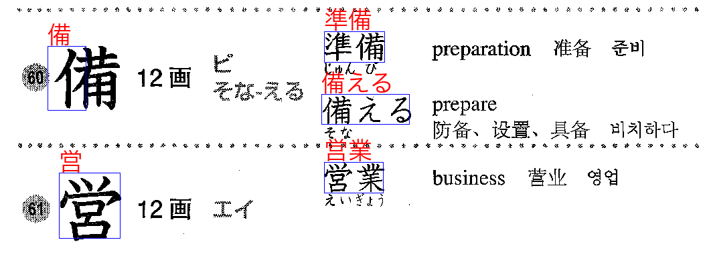

# kanji_book_cloud_vision

Python tool for reading kanjis and japanese vocabulary words from an
image. It uses [Google Cloud Vision](https://googleapis.dev/python/vision/latest/index.html) for OCR.

### Usage

```
python kanji_book_cloud_vision.py input.png output.yml
```



`output.yml`:
```
- string: 備
  type: kanji
- string: 準備
  type: vocab
- string: 備える
  type: vocab
- string: 営
  type: kanji
- string: 営業
  type: vocab

```
